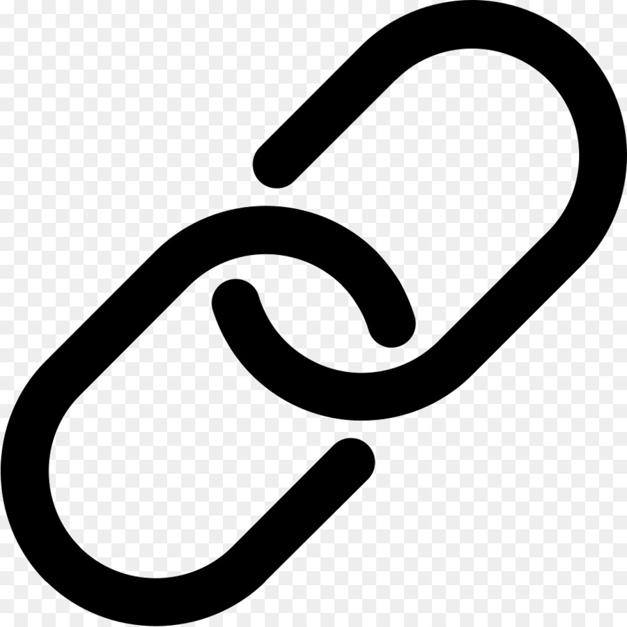
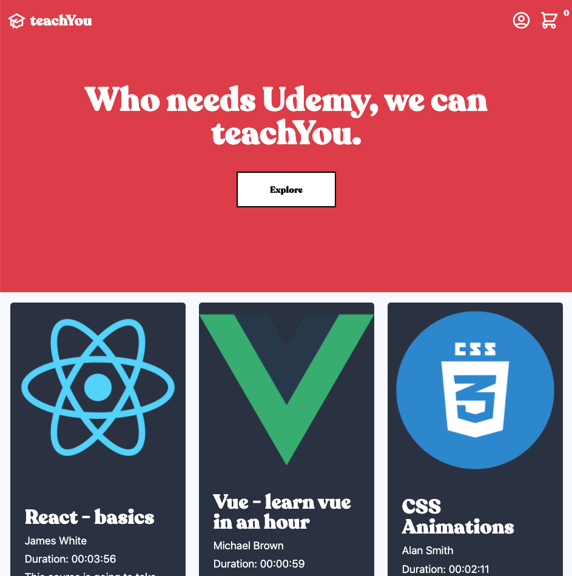
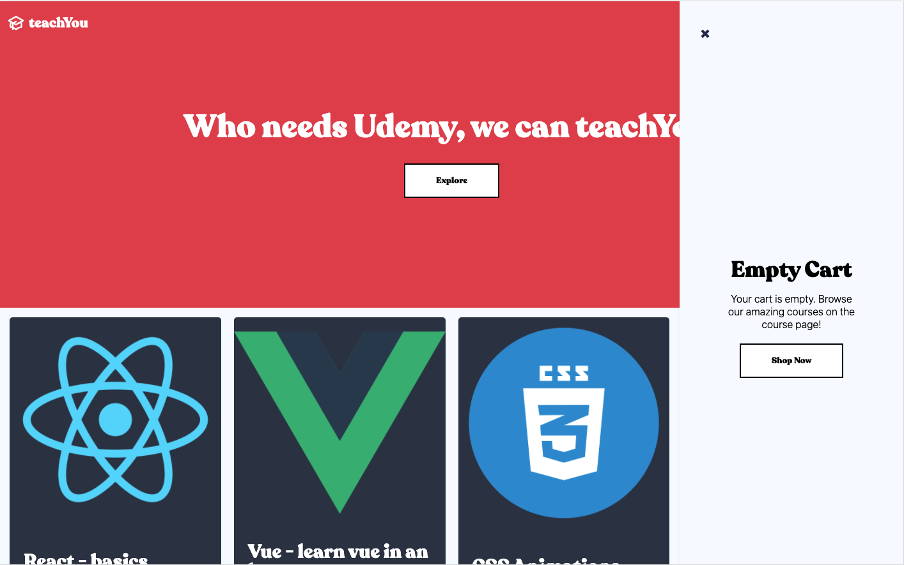
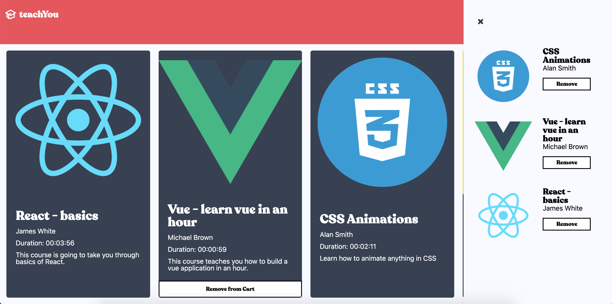
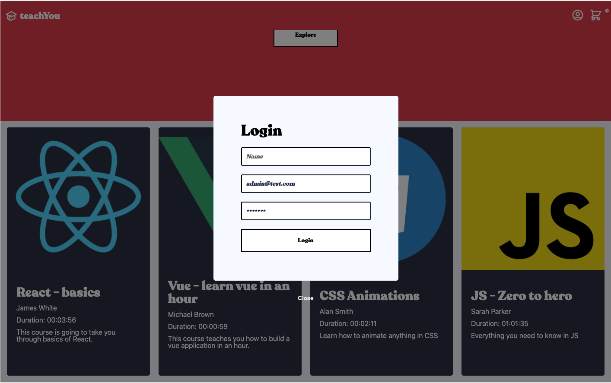
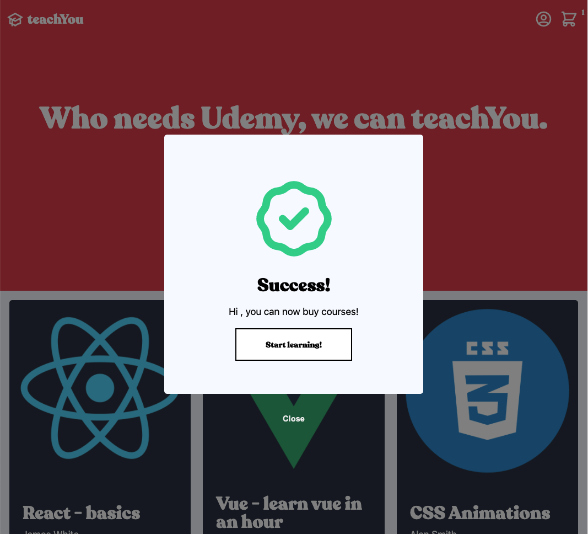
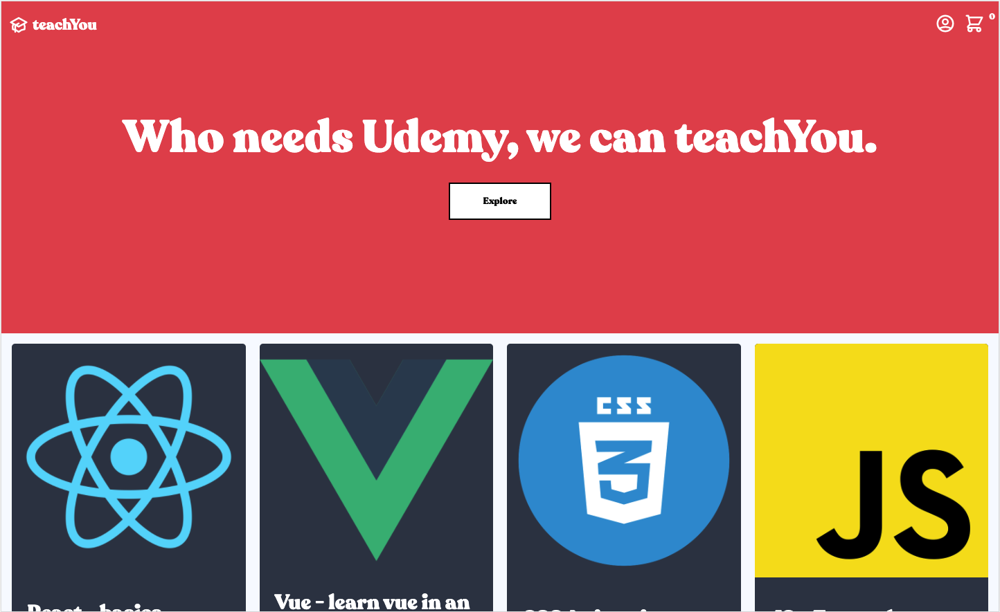

 

# teachYou - Development

The next best thing in online courses. You needs udemy anyway? Our courses will bring you from zero code to a bona-fide Bertram Gilfoyle!

    
    
    

### Criteria Chosen & Completed

- [x] It should display list of all available courses
- [ ] It should have a search field where you can search and filter available courses by typing in the search field
- [ ] It should have a sort filter, you should be able to sort courses by date and duration
- [x] Hovering over a course should display an add button
- [x] Clicking on the add button should open a modal asking for your login credentials
- [x] After submitting the form with any credentials, user must get a successful login message and modal should close
- [x] Course should be added to a cart on the side of the screen
- [x] Clicking on new add button should not promote login modal if you have already logged in and it should add course to the side cart
- [x] If a course has already been added to your cart, hovering over should display a remove button
- [x] Clicking on the remove button should remove course from side cart

## Features

- Context API for state management including the cart and user state, as well as their respective helper functions to be available throughout the projects global scope.
- Local storage to prevent annoying reloading. Stored the cart and user objects in localStorage and get from localStorage as default state on load.
- Header, Hero and Product Grid responsive down to small mobile screens.
- Mini cart with empty cart message component
- Login modal with loading and success message
- Responsive layout using a mobile-first approach, utilising the nesting and targeting available with SCSS and Styled Components.
- Globally styled elements using the globalStyles hook from Styled Components. As well as a global component where I have exported global styled elements such as buttons from.
- Successfully hosted on Netlify.

### Approach

My approach for this project was to create the best UI/UX experience possible, placing a lot of attention on the presentation layer of the application. As such, I have focused on the criteria that make up the most basic functionality layer of a simple eCommerce application: cart functionality, product interaction, and a login system.

I chose these features as I felt they were achievable within the time frame, could be done well with a greater focus on UI/UX and provide the building blocks for additional features like search and filtering to be added to an app that does the basics well.

The biggest challenges in this project were managing state using the Context API and testing using the React Testing Library. This project was a great opportunity to explore tools like Context as it was small enough to not get out of hand, but complex enough to gain a workable knowledge of global state management.

### Features

#### Mini Cart

Empty Cart

Full Cart

#### Login Modal

Login

Success

### Responsive Views

#### Desktop (1400px)

#### Tablet (768px)

#### Mobile (< 768px)

